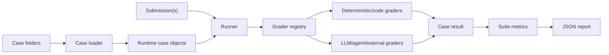

# Evaluation 仓库实现设计

## 1. 设计原则

- 仓库边界是评测 agent 候选输出；agent 执行由外部系统完成。
- case 是数据定义，infra 负责把它解析成可执行结构。
- case 作者只需要编辑 query、prompt、grader JSON 或 Python 代码文件。
- deterministic grader 优先，开放性问题走 rubric/external。
- capability 与 regression 使用同一 case schema，但归属不同集合。
- 所有评测结果都结构化，方便 CI、报表和后续分析。

## 2. 数据流



## 3. 核心模块

- `models.py`：case、submission、grader result、case result、suite result 的数据结构。
- `case_loader.py`：发现 case folder，读取 `case.json` 和 `graders/` 下的 grader 文件。
- `graders/registry.py`：按 grader type 分发。
- `graders/deterministic.py`：产物存在、trace 信号等通用检查。
- `graders/pptx.py`：PPTX 结构解析和 slides 静态检查。
- `graders/code.py`：执行 Python code grader，代码需要定义 `grade(payload)`。
- `graders/judges.py`：LLM/agent judge 的 prompt 载入和外部命令转发。
- `graders/external.py`：外部命令协议，用于 scripted grader、LLM/PI/OpenCode grader。
- `pipeline.py`：执行 case 对 submission 的评测、聚合分数和 suite 指标。
- `metrics.py`：`pass@k` 与 `pass^k`。
- `cli.py`：命令行入口。

## 4. 数据定义层

推荐每个 case 使用一个文件夹：

```text
cases/<task_family>/<set>/<case_slug>/
  case.json
  graders/
    deck_exists.json
    structure.json
    quality.prompt.md
    optional_code_check.py
  attachments/
    optional_input.csv
```

`case.json` 描述任务并引用 grader：

- `question.query`：用户问题。
- `question.browser_initial_state`：浏览器初始状态。
- `question.attachments`：输入附件。
- `output_contract`：期望输出，例如是否需要 deck。
- `grader_files`：相对 case 文件夹的 grader 文件路径。
- `success_threshold`：case 层通过阈值。

附件规则：

- 带附件的 case 必须把文件放在该 case 文件夹的 `attachments/` 子目录中。
- `question.attachments[].path` 和 `question.browser_initial_state.local_files[]` 使用相对 case 文件夹的路径，路径必须以 `attachments/` 开头。
- `case_loader` 加载 case 时会校验附件文件存在，并在运行时结构中为附件补充 `resolved_path`，为 `local_files` 补充 `resolved_local_files`。
- 缺失附件、绝对路径或跳出 `attachments/` 的路径都会让 case 加载失败，避免评测时才暴露不可读输入。

grader 文件是评测规则：

- `.json`：结构化 grader，例如 `artifact_presence`、`pptx_structure`、`trace_signal`。
- `.prompt.md`：LLM/agent 评审 prompt，文件头写权重和阈值。
- `.py`：Python code grader，必须定义 `grade(payload)` 并返回结果 dict。

## 5. Case Runtime Schema

infra 解析之后，一个 evaluation case 包含：

- `id`：稳定 ID，建议包含任务族、类型和版本。
- `set`：`capability` 或 `regression`。
- `task_family`：例如 `slides`、`research`、`browser_ops`。
- `task_type`：任务子类型，例如 `data_presentation`。
- `input`：用户 query、浏览器初始状态、附件。
- `input.attachments[].resolved_path`：loader 解析出的附件绝对路径，供 runner、外部 grader 或评审 agent 读取。
- `input.browser_initial_state.resolved_local_files`：loader 解析出的本地文件绝对路径列表。
- `output_contract`：候选输出应该包含哪些产物。
- `graders`：grader 列表，每个 grader 有 type、weight、threshold、required 和 config。
- `success_threshold`：case 层通过阈值。

## 6. Submission Schema

一次 agent 尝试输出一个 submission：

- `case_id`：对应 case。
- `attempt_id`：同一 case 的第几次尝试。
- `process`：agent 执行过程，包括 thinking、tool call、observation 和中间状态。
- `final_report`：agent 给用户的最终回复或汇报。
- `artifacts`：候选产物列表，每个产物有 id、kind、path；没有文件时可以为空数组。
- `metadata`：模型、运行环境、时间等补充信息。

## 7. Grader 聚合

每个 grader 返回：

- `score`：0 到 1。
- `passed`：是否达到 grader 阈值。
- `status`：`passed`、`failed`、`skipped`、`error`。
- `summary`：一句话解释。
- `details`：结构化证据。

case 层分数按已执行 grader 的权重加权。required grader 失败、报错或跳过时，case 标记为失败。非 required 的 skipped grader 从分母中排除，同时 case 标记为 incomplete。

## 8. 扩展方式

新增任务族：

1. 在 `cases/<family>/capability/<case_slug>/` 或 `cases/<family>/regression/<case_slug>/` 中添加 case。
2. 复用通用 grader，或在 `graders/` 添加新 grader。
3. 在 registry 中注册新 grader type。
4. 为高风险 grader 添加单元测试。

新增外部评审：

1. 在 case 的 grader config 中配置 `command`，grader type 可用 `scripted_command` 或 `external_command`。
2. 外部命令从 stdin 读取 JSON。
3. 外部命令向 stdout 输出 JSON，或写入 `output_result_file` 指定的 JSON 文件。
4. Runner 将该输出纳入统一结果。

## 9. 两轮自检结果

第一轮实现自检：

- 仓库结构保留了 data define、task define、pipeline 三个边界。
- slides case 是第一个任务族，schema 保持任务族无关。
- LLM/agent grader 保持供应商无关，后续可以替换。
- case folder 与 infra loader 解耦，非技术作者可以主要编辑数据文件。

第二轮实现自检：

- 无外部依赖也能运行 deterministic tests，适合早期快速迭代。
- PPTX 解析使用标准库，覆盖结构检查；复杂视觉渲染留给后续 visual grader。
- CLI 接受多个 submission，能自然支持 pass@3/pass^3。
